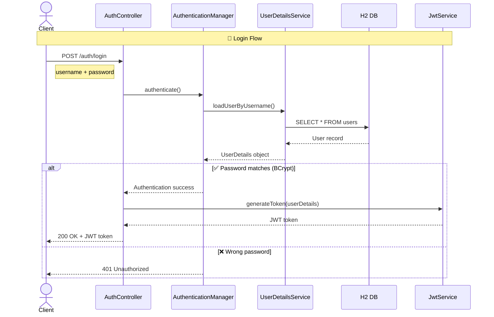
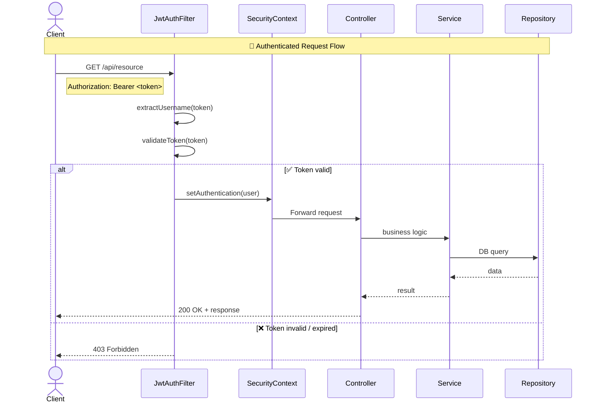

# Spring Boot JWT Security Project

## Project Flow

### Login Flow

```mermaid
sequenceDiagram
    actor Client
    participant AuthController
    participant AuthenticationManager
    participant UserDetailsService
    participant H2 DB
    participant JwtService

    Note over Client,JwtService: 🔐 Login Flow

    Client->>AuthController: POST /auth/login
    Note right of Client: username + password

    AuthController->>AuthenticationManager: authenticate()
    AuthenticationManager->>UserDetailsService: loadUserByUsername()
    UserDetailsService->>H2 DB: SELECT * FROM users
    H2 DB-->>UserDetailsService: User record
    UserDetailsService-->>AuthenticationManager: UserDetails object

    alt ✅ Password matches (BCrypt)
        AuthenticationManager-->>AuthController: Authentication success
        AuthController->>JwtService: generateToken(userDetails)
        JwtService-->>AuthController: JWT token
        AuthController-->>Client: 200 OK + JWT token
    else ❌ Wrong password
        AuthenticationManager-->>Client: 401 Unauthorized
    end
```

### Authenticated API Call

```mermaid
sequenceDiagram
    actor Client
    participant JwtAuthFilter
    participant SecurityContext
    participant Controller
    participant Service
    participant Repository

    Note over Client,Repository: 🔑 Authenticated Request Flow

    Client->>JwtAuthFilter: GET /api/resource
    Note right of Client: Authorization: Bearer <token>

    JwtAuthFilter->>JwtAuthFilter: extractUsername(token)
    JwtAuthFilter->>JwtAuthFilter: validateToken(token)

    alt ✅ Token valid
        JwtAuthFilter->>SecurityContext: setAuthentication(user)
        SecurityContext->>Controller: Forward request
        Controller->>Service: business logic
        Service->>Repository: DB query
        Repository-->>Service: data
        Service-->>Controller: result
        Controller-->>Client: 200 OK + response
    else ❌ Token invalid / expired
        JwtAuthFilter-->>Client: 403 Forbidden
    end
```